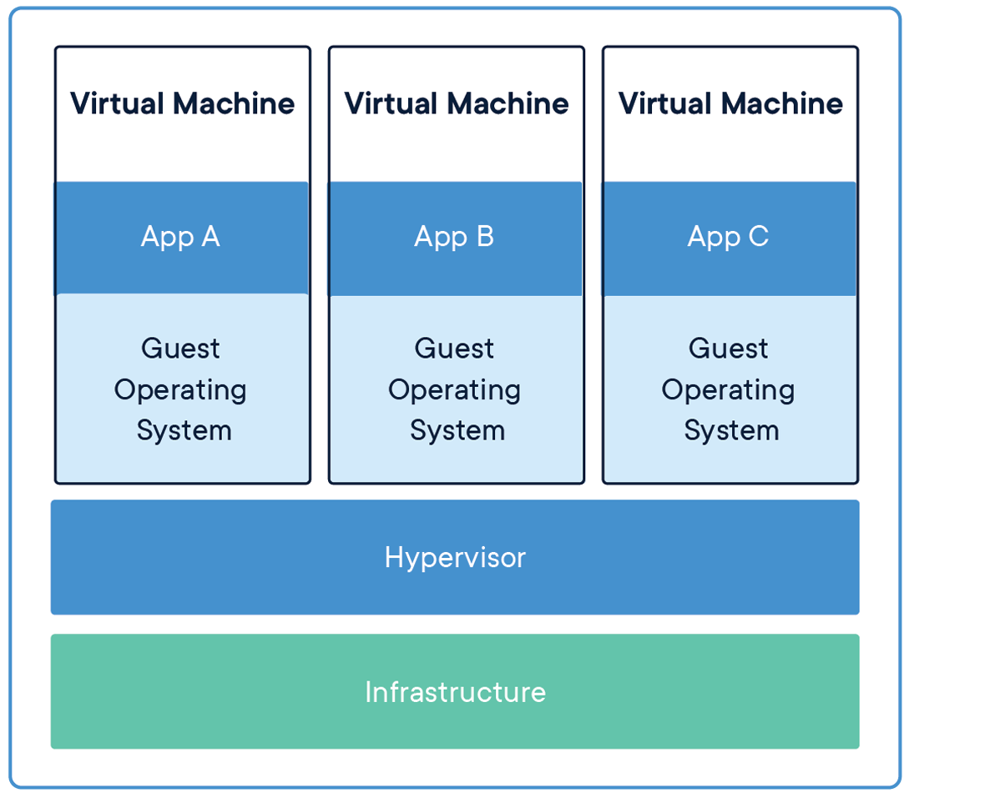
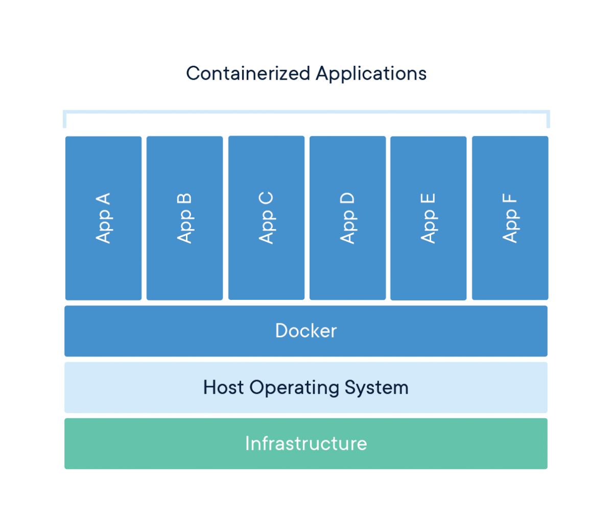

## Containerization
### Introduction

Containerization has revolutionized how we develop, deploy, and run software. At its core, containerization is a method of packaging an application along with all its dependencies—libraries, configuration files, and everything else it needs to run—into a standardized unit called a container. This container can then be reliably transported and run on any computing environment that supports containers.

Think of containers like standardized shipping containers used in global logistics. Before standardized shipping containers existed, loading and unloading cargo ships was inefficient and unpredictable—different-sized crates and packages made storage challenging and transportation slow. The introduction of uniform shipping containers revolutionized global trade by creating a standard unit that could be easily loaded, stacked, transported, and unloaded regardless of what was inside.

Software containers work on the same principle. Instead of shipping physical goods, we're packaging software in a way that eliminates the traditional challenge of "it works on my machine but not in production." Containers encapsulate the application and its environment, ensuring consistent behavior across different computing infrastructures—from a developer's laptop to testing environments to production servers.

What makes containers particularly powerful for developers and system administrators is their combination of isolation and efficiency. Unlike traditional virtual machines that virtualize an entire operating system, containers share the host system's kernel while maintaining strict isolation between applications. This makes them significantly more lightweight and faster to start than VMs, while still providing the necessary separation between applications.

For servers, containerization offers several benefits:

- **Resource Efficiency:** Containers have minimal overhead, making them perfect for the limited resources of a Raspberry Pi
- **Isolation:** Applications in containers won't interfere with each other or the host system
- **Reproducibility:** Container definitions are code, making your server setup reproducible and version-controlled
- **Portability:** The same container can run on your Pi, your MacBook, or any other compatible system
- **Simplified Deployment:** Containers bundle all dependencies, eliminating complex installation procedures
- **Easy Updates:** Containers can be replaced rather than updated in-place, simplifying maintenance

In this guide, we'll first explore the foundational concepts of containerization to build a solid understanding of the technology. Then, we'll dive into Docker—the most popular containerization platform—and create a practical setup for a Python container running on your Raspberry Pi. This container will allow you to use your MacBook as a client for development while leveraging the compute resources and persistent storage of your Pi server.

By the end of this guide, you'll have both a theoretical understanding of containerization and practical experience implementing it, setting the stage for more advanced container-based projects like PostgreSQL databases, development environments, and even multi-container applications. It will help to checkout my starter guide on setting up Linux Server LTS on a Raspberry Pi, if you want to know exactly what kind of system I'm using. Otherwise, most of the examples will focus on Docker, not my specific environment.

### Basic Concepts
#### Key Terms

- **Container:** A lightweight, standalone, executable package that includes everything needed to run a piece of software: code, runtime, system tools, libraries, and settings.
- **Image:** A read-only template used to create containers. Images contain the application code, libraries, dependencies, tools, and other files needed for an application to run.
- **Container Engine:** Software that accepts user requests, including command line options, pulls images, and uses the operating system's functionality to create and manage containers.
- **Namespace:** A Linux kernel feature that partitions system resources so that one set of processes sees one set of resources while another set of processes sees a different set of resources.
- **Control Group (cgroup):** A Linux kernel feature that limits, accounts for, and isolates the resource usage (CPU, memory, disk I/O, etc.) of process groups.
- **Host:** The physical or virtual machine on which containers run.
- **Registry:** A service that stores and distributes container images, similar to a Git repository for code.
- **Layer:** Part of an image that represents a set of filesystem changes. Images are built from a series of layers, making them efficient to store and transfer.
- **Volume:** A designated directory in the container that exists outside the default Union File System, used for persisting data or sharing data between containers.
- **Port Binding:** Mapping a container's port to a port on the host machine, allowing external access to services running inside the container.

#### How Containers Work
Containers achieve their isolation and efficiency through several key Linux kernel features, primarily `namespaces` and `control groups (cgroups)`. Namespaces create isolation by providing processes with their own view of system resources. Linux implements various namespace types:

- **PID Namespace:** Isolates process IDs
- **Network Namespace:** Isolates network interfaces
- **Mount Namespace:** Isolates filesystem mount points
- **UTS Namespace:** Isolates hostname and domain name
- **IPC Namespace:** Isolates interprocess communication resources
- **User Namespace:** Isolates user and group IDs

When a container starts, it gets its own set of these namespaces, making it appear to the application inside that it has its own isolated instance of the operating system.

- `Control Groups (cgroups)`: Provide resource limitation and accounting. They ensure containers can only use allocated amounts of system resources like CPU, memory, and I/O. This prevents a single container from consuming all available resources and affecting other containers or the host system.
- `Union File Systems`: Another key technology behind containers. They create layers of file system changes, enabling efficient storage and quick creation of containers. When a container is built from an image, each instruction in the image definition typically creates a new layer. These layers are cached, meaning unchanged layers can be reused between different images, saving both disk space and build time.

#### Containers vs. Virtual Machines
A common point of confusion for newcomers is how containers differ from virtual machines (VMs). Both provide isolation, but they work in fundamentally different ways.

**Virtual Machines:**

- Run a complete operating system with its own kernel
- Virtualize hardware resources through a hypervisor
- Require more storage space and memory
- Take minutes to start up
- Provide strong isolation at the hardware level



**Containers:**

- Share the host operating system's kernel
- Virtualize at the operating system level, not hardware
- Require minimal storage space and memory
- Start in seconds or milliseconds
- Provide process-level isolation



This architectural difference explains why containers are so much more lightweight than VMs. While a typical VM might be gigabytes in size and take minutes to start, a container can be megabytes in size and start in seconds.

### Networking for Containers
#### Basic Networking
Understanding container networking is essential for building practical container-based applications. Container networking fundamentally relies on Linux network namespaces, which provide each container with its own isolated network stack including:

- Network interfaces
- IP addresses
- Routing tables
- Firewall rules
- Socket port numbers

Most container engines support several networking modes:

- **Bridge Networking:** The default mode where containers connect to a software bridge on the host, giving them their own IP addresses on an isolated network. Port mappings allow external access.
- **Host Networking:** Containers share the host's network namespace with no network isolation, seeing the same network interfaces as the host. This offers the best performance but reduces isolation.
- **None Networking:** Containers have no external network connectivity, useful for processing-only workloads that don't need network access.
- **Overlay Networking:** Creates a distributed network among multiple container hosts, allowing containers on different hosts to communicate as if on the same local network.
- **Macvlan Networking:** Gives containers their own MAC address, making them appear as physical devices on the network.

#### Advanced Networking
In bridge networking, containers communicate freely on their isolated network but need `port mapping` to be accessible from outside. For example, mapping port 8888 on your Raspberry Pi to port 8888 in a container would let you access a Python container by connecting to your Pi's IP address on port 8888.

Containers typically use DNS for service discovery:

- Container engines often provide built-in DNS resolution between containers
- Containers can usually resolve external domain names using the host's DNS configuration
- In multi-container applications, service discovery systems help containers find each other automatically

#### Existing Server Configuration
My Raspberry Pi server setup already includes:

- Non-standard SSH port (45000)
- UFW (Uncomplicated Firewall) configuration
- Fail2ban for protection against brute-force attacks

Any containerized services will need to work with these existing configurations. Later, when we set up our Python container, we'll need to:

- Choose a port that doesn't conflict with existing services
- Configure UFW to allow traffic to this port
- Ensure the container's networking integrates with your existing security measures

### Using Containers
Containerization's versatility makes it valuable across various computing scenarios. Here are some common use cases that demonstrate why containers have become so foundational in modern computing. 

#### Application Development and Testing
For developers, containers solve the "it works on my machine" problem by ensuring consistency across development, testing, and production environments. Benefits include:

- **Consistent Development Environments:** Every developer works with identical dependencies and configurations
- **Faster Onboarding:** New team members can start with a working environment immediately
- **Parallel Version Testing:** Run applications with different dependency versions simultaneously
- **Continuous Integration:** Test code in clean, reproducible environments

For example, a development team working on a web application can define their entire stack—from database to web server—as containers. New developers simply pull the container definitions and start working immediately, rather than spending days configuring their local environment.

#### Microservices Architecture
Containers are ideal for microservices, where applications are composed of many small, independent services:

- **Service Isolation:** Each microservice runs in its own container
- **Independent Scaling:** Scale containers individually based on demand
- **Technology Flexibility:** Use different programming languages and frameworks for different services
- **Simplified Updates:** Update individual services without affecting others

Netflix, for instance, uses containers to manage thousands of microservices that power their streaming platform, allowing them to update and scale individual components without disrupting the entire service.

#### Edge Computing and IoT
Containers are increasingly used in edge computing and Internet of Things (IoT) scenarios:

- **Resource Efficiency:** Containers' low overhead works well on limited-resource devices
- **Remote Management:** Deploy and update container workloads remotely
- **Standardization:** Same container can run in the cloud and at the edge
- **Isolation:** Run multiple applications on a single edge device securely

My Raspberry Pi is an example of an edge device that can benefit from containerization, allowing you to run multiple services efficiently on limited hardware.

#### Personal Projects and Self-Hosting
For personal projects and self-hosting, containers offer significant advantages:

- Application Isolation: Run multiple applications without conflicts
- Easy Backups: Back up container volumes or entire container states
- Simple Updates: Update applications by pulling new container images
- Resource Management: Limit resource usage for each application

#### Specific Raspberry Pi Use Cases
For your Raspberry Pi server specifically, containerization enables:

- **Database Servers:** Host PostgreSQL, MySQL, or MongoDB without complex setup
- **Web Applications:** Deploy web services with proper isolation
- **Development Tools:** Run Git servers, CI/CD pipelines, or code quality tools
- **Media Services:** Host Plex, Jellyfin, or other media servers
- **Home Automation:** Run Home Assistant, Node-RED, or other automation tools

### Adjacent and Complementary Topics
While containers themselves are powerful, they're part of a broader ecosystem of technologies and practices. Understanding these adjacent areas will help you get the most from containerization.

#### Container Orchestration
For managing multiple containers across multiple hosts:

- **Kubernetes:** The industry-standard container orchestration platform
- **Docker Swarm:** A simpler orchestration solution integrated with Docker
- **K3s/K3d:** Lightweight Kubernetes distributions suitable for Raspberry Pi
- **Nomad:** HashiCorp's workload orchestrator supporting containers and other applications

Container orchestration becomes important when you need high availability, automated scaling, or management of complex multi-container applications.

#### CI/CD (Continuous Integration/Continuous Deployment)
Containers integrate naturally with modern software development practices:

- **Automated Testing:** Run tests in clean container environments
- **Build Pipelines:** Automatically build container images when code changes
- **Deployment Automation:** Automatically deploy new container versions
- **Infrastructure as Code:** Define your entire infrastructure declaratively

Tools like GitHub Actions, GitLab CI, Jenkins, and CircleCI all support container-based workflows.

#### Infrastructure as Code
Managing container environments declaratively:

- **Docker Compose:** Define multi-container applications
- **Terraform:** Provision and manage infrastructure including container hosts
- **Ansible:** Automate container deployment and configuration
- **Helm:** Package and deploy applications to Kubernetes

Infrastructure as Code makes your container setups reproducible, version-controlled, and easier to maintain.

#### Monitoring and Observability
With containers, traditional monitoring approaches need adaptation:

- **Container Metrics:** CPU, memory, network, and disk usage per container
- **Logging Solutions:** Collecting and centralizing logs from ephemeral containers
- **Application Performance Monitoring:** Tracing requests across container boundaries
- **Service Meshes:** Advanced networking with observability features

Tools like Prometheus, Grafana, ELK Stack (Elasticsearch, Logstash, Kibana), and Jaeger help monitor containerized environments.

#### Security Considerations
Container security requires specific attention:

- **Image Scanning:** Detecting vulnerabilities in container images
- **Runtime Security:** Monitoring container behavior for anomalies
- **Secure Supply Chains:** Ensuring the integrity of images from source to runtime
- **Privilege Management:** Running containers with minimum necessary privileges

Solutions like Trivy, Falco, Notary, and proper security practices help keep containerized environments secure.

### Conclusion
Containerization represents one of the most significant shifts in how we develop, deploy, and run software in recent years. By packaging applications with their complete runtime environment, containers solve the long-standing problem of environment inconsistency while providing resource efficiency and isolation.

In this first section, we've explored the fundamental concepts behind containers—how they use Linux kernel features like namespaces and cgroups to provide lightweight isolation, how they differ from virtual machines, and why they've become essential in modern computing. We've also looked at various use cases and adjacent technologies that complement containerization.

With this foundational understanding in place, we're now ready to move from theory to practice. In the next section, we'll dive into Docker—the most popular containerization platform—and learn how to create, manage, and use containers on your Raspberry Pi server. We'll build a Python environment that lets you combine the convenience of developing on your laptop with the persistent computing resources of your Raspberry Pi.

This practical implementation will make these container concepts concrete while giving you a valuable tool for data analysis, coding, and experimentation—all within a properly isolated environment that won't affect the rest of your server setup.

## Docker
### Introduction
Docker has revolutionized application development and deployment by providing a standardized way to package, distribute, and run applications in isolated environments called containers. In this comprehensive guide, we'll explore Docker from basic concepts to advanced implementations, using a Python container as our primary example.

Docker enables you to package an application with all its dependencies into a standardized unit called a container. These containers can run consistently across different environments, from development machines to production servers, eliminating the classic "it works on my machine" problem. This consistency is particularly valuable when working with complex data science or software engineering environments, which often have numerous interdependent libraries and packages.

#### Why Python Containers?
**First**, Python containers demonstrate the fundamental value proposition of containerization through environment isolation. Python development often suffers from dependency conflicts where different projects require incompatible package versions. A data analysis project might need pandas 1.3.0 while a web scraping project requires pandas 2.0.0, and installing both system-wide creates conflicts. Docker containers provide perfect isolation for these environments, allowing you to maintain multiple Python environments with completely different dependency sets without any interference. **Second**, Python containers enable computational offloading in a way that's particularly valuable for Raspberry Pi servers. You can write and test Python code on your laptop using your preferred editor, then execute that code on your Raspberry Pi's resources while your laptop remains responsive for other tasks. **Third**, persistence and accessibility become seamless with containerized Python environments. A Python container running on your Raspberry Pi can execute scripts continuously, maintain long-running processes, and store results in persistent volumes that survive container restarts. **Fourth**, Python containers showcase reproducibility across development stages. The same container that runs on your Raspberry Pi can run on your laptop, on a colleague's machine, or on a cloud server. **Fifth**, testing in clean environments becomes trivial with containers. Before committing code changes, you can spin up a fresh Python container, run your tests, and then destroy the container. This ensures your tests aren't passing due to some artifact in your development environment. Each test run starts from a known, clean state.

**Finally**, Python containers provide an excellent foundation for scalability. Starting with a simple Python container gives you a clear path to more complex setups. You might begin with a single container running a script, then expand to add a PostgreSQL database container for data storage, then add a Redis container for caching, and eventually orchestrate multiple Python worker containers processing tasks in parallel. Each step builds naturally on your foundation. 
By focusing on Python containers, we'll cover Docker's most important concepts—images, containers, volumes, networking, and orchestration—in a context that's immediately practical for development work. Python's ubiquity in data engineering, automation, web development, and scripting makes it an ideal teaching tool that you'll actually use beyond this learning exercise. As we progress through each section, you'll build a functional containerized Python environment that serves as both a learning platform and a practical development tool for any Python-based project you might undertake on your Raspberry Pi server.


#### Basic Concepts
Before diving into implementation, let's establish a clear understanding of Docker's core concepts and terminology. These fundamentals will provide the foundation for everything we build throughout this guide.

- **Docker Engine:** The runtime that builds and runs containers. It consists of:
  - A server (daemon) that manages containers
  - REST API that programs can use to communicate with the daemon
  - Command-line interface (CLI) for user interaction
- **Docker Image:** A read-only template containing application code, libraries, dependencies, tools, and other files needed to run an application. Think of an image as a snapshot or blueprint of an application and its environment.
- **Docker Container:** A runnable instance of an image—what the image becomes in memory when executed. A container runs completely isolated from the host environment, accessing only kernel capabilities and resources explicitly allowed.
- **Dockerfile:** A text file containing instructions for building a Docker image. It specifies the base image, additional components, configurations, and commands to be included.
- **Docker Registry:** A repository for Docker images. Docker Hub is the default public registry, but private registries can also be used. Images are stored with tags to identify different versions.
- **Docker Compose:** A tool for defining and running multi-container Docker applications using a YAML file to configure application services, networks, and volumes.

Docker uses a client-server architecture where the Docker client communicates with the Docker daemon. The daemon handles building, running, and distributing Docker containers. The Docker client and daemon can run on the same system, or you can connect a Docker client to a remote Docker daemon—making it especially suitable for our Raspberry Pi server setup.

The Raspberry Pi uses ARM architecture, which differs from the x86/x64 architecture used in most desktop and server computers. This creates some important considerations when working with Docker:

- **Image compatibility:** Docker images are architecture-specific. Many popular images offer ARM variants (often tagged with arm32v7 or arm64v8), but not all do. Always check if images have ARM support before attempting to use them.
- **Performance considerations:** Some Docker images may run slower on ARM processors depending on the workload. Computationally intensive operations in containers might experience more significant performance differences compared to x86/x64 architectures.
- **Building images locally:** Building Docker images directly on your Raspberry Pi ensures architecture compatibility but may take longer due to limited resources. For complex builds, consider using Docker's BuildKit with multi-architecture support.
- **Image size awareness:** ARM devices like Raspberry Pi often have storage limitations. Be particularly mindful of image sizes and use lightweight base images where possible.

For our Python implementation, we'll address these considerations by selecting ARM-compatible base images and optimizing for the Raspberry Pi's resources. 

That concludes the introduction, next we'll focus on configuring VS Code to work with Docker better, both on your client and server. Then, we'll dive into the actual implementation.

### Docker Concepts and Background Information
Understanding Docker's fundamental concepts is essential before diving into practical implementation. This section will establish the foundational knowledge you need to work effectively with containers, covering the core components that make Docker work, the relationship between images and containers, and how Docker fits into modern development workflows.

#### Docker Components
Docker consists of several interconnected components that work together to provide containerization capabilities. Understanding these components helps you grasp how Docker operates under the hood and what actually happens when you install Docker on your server.

**Docker Engine** serves as the core runtime that makes containerization possible. Think of Docker Engine as the heart of the entire Docker system - it's the foundational technology that creates and manages containers on your host system. The Engine handles the low-level operations like creating container filesystems, managing network interfaces, and coordinating with the Linux kernel to provide isolation.

**Docker CLI (Command Line Interface)** is the primary way users interact with Docker. The CLI is a client application that translates your commands into API calls that the Docker daemon can understand. When you type commands like docker run or docker build, you're using the CLI to communicate your intentions to the Docker system. The CLI acts as a bridge between human-readable commands and the technical operations Docker needs to perform.

**Docker Daemon** is a background service (a program that runs continuously without direct user interaction) that listens for Docker API requests and manages Docker objects like images, containers, networks, and volumes. The daemon is the component that actually executes the work - when you ask Docker to start a container, the daemon handles creating the container, allocating resources, and monitoring its lifecycle. The daemon runs with elevated privileges because it needs to interact directly with the Linux kernel's containerization features.

**So, what is actually installed on a headless server?** When you install Docker on a headless Ubuntu server like your Raspberry Pi, you're primarily installing the Docker Engine and CLI tools. The installation process sets up several key components: the Docker daemon service that starts automatically with your system, the Docker CLI binary that allows you to issue commands, and the necessary configuration files and directories where Docker stores images, container data, and runtime information.

Unlike desktop installations that might include graphical interfaces, a headless server installation focuses on the core functionality needed to build, run, and manage containers through command-line operations. The installation also configures systemd service definitions so Docker starts automatically when your server boots, ensuring your containerized applications can restart after system reboots.

The relationship between these components follows a client-server architecture pattern. When you execute a Docker command, the CLI parses your command and sends an HTTP request to the Docker daemon's API endpoint. The daemon receives this request, validates it, and performs the requested operation. For example, when you run docker container ls, the CLI sends a request to the daemon asking for a list of running containers, the daemon queries its internal state, and returns the information back through the CLI to your terminal.

This separation of concerns allows for flexible deployment scenarios. You can run the Docker CLI on one machine and connect it to a Docker daemon running on a remote server, enabling remote container management. The daemon handles all the heavy lifting of actually managing containers, while the CLI provides a user-friendly interface for sending commands and receiving feedback.

#### Images and Containers
One of the most important concepts to understand in Docker is the distinction between images and containers. This relationship forms the foundation of how Docker works, and grasping it clearly will make everything else about Docker much more intuitive.

**A Docker image** is a read-only template that contains instructions for creating a container. Think of an image as a blueprint or recipe - it defines what should be included in a container but doesn't actually run anything. Images contain application code, libraries, dependencies, configuration files, and metadata needed to create a functioning container environment. Images are static and immutable, meaning once they're built, they don't change.

**A Docker container** is a runnable instance of an image. If an image is a blueprint, then a container is the actual house built from that blueprint. When you start a container from an image, Docker creates a writable layer on top of the read-only image layers and starts the defined processes. Multiple containers can be created from the same image, just like multiple houses can be built from the same blueprint, and each container operates independently with its own filesystem changes, network interfaces, and running processes.

The key insight is that images are for distribution and storage, while containers are for execution. You build or download images once, but you can run many containers from those images. When a container is deleted, any changes made inside it are lost unless they were saved to persistent storage, but the original image remains unchanged and can be used to create new containers.

**Base images** form the foundation of the Docker image hierarchy. A base image is typically a minimal operating system image like Ubuntu, Alpine Linux, or CentOS that provides the basic filesystem and tools needed to run applications. Base images are built "from scratch" and don't inherit from other images. They provide the fundamental layer upon which other images are built.

**Parent images** are images that your image extends or builds upon. When you create a Dockerfile that starts with FROM ubuntu:20.04, you're using ubuntu:20.04 as your parent image. Your new image inherits everything from the parent image and then adds your specific modifications on top. Parent images can themselves be built on other images, creating a hierarchy of inheritance.

**Child images** are images built from parent images. These images add specific applications, configurations, or customizations to their parent. For example, you might create a child image that takes a base Ubuntu image and adds Python, then create another child image that adds your specific Python application and its dependencies. This layered approach promotes reusability and efficient storage.

**Docker images use a layered filesystem** architecture that provides significant efficiency benefits. Each instruction in a Dockerfile creates a new layer in the image. These layers are stacked on top of each other to form the complete filesystem that containers see. When you modify a file that exists in a lower layer, Docker uses a copy-on-write mechanism - the file is copied to the current layer and then modified, leaving the original layer unchanged.

This layered approach enables powerful optimizations. If multiple images share common base layers, Docker only stores those layers once on disk, saving significant storage space. When you pull an image from a registry, Docker only downloads the layers you don't already have locally. When you build images, Docker can reuse layers from previous builds if the instructions haven't changed, dramatically speeding up the build process.

The layered system also enables efficient image distribution. Instead of transferring entire filesystem images, Docker can transfer only the layers that have changed. This makes image updates much faster and reduces bandwidth usage, especially important when working with large applications or limited network connections.

#### Registries
**A Docker registry** is a storage and distribution system for Docker images. Registries serve as centralized repositories where you can upload (push) your images and download (pull) images created by others. Think of a registry as a combination library and distribution center for containerized applications - it stores images in an organized, searchable format and provides reliable access to those images from anywhere on the internet. Another way of looking at it, like `git`, but specific for images.

Registries solve several critical challenges in containerized application development. They provide a central location for storing different versions of your applications, enable sharing images across development teams and deployment environments, and offer a reliable way to distribute your applications to production servers. Without registries, you would need to manually transfer image files between systems, making deployment and collaboration extremely cumbersome.

**Registries provide several important benefits.** 

- **Version control** for your containerized applications. 
  - You can tag images with version numbers, enabling you to deploy specific versions, roll back to previous versions, and maintain multiple versions simultaneously. 
  - This versioning capability is essential for production deployments where you need to track exactly which version of an application is running in each environment.
- **Collaboration** becomes seamless with registries. 
  - Team members can share images by pushing them to a registry, eliminating the need to share large image files directly.
  - Developers can pull the latest versions of applications built by their colleagues, ensuring everyone works with consistent environments. 
  - This collaboration extends to CI/CD systems, which can automatically build images and push them to registries for deployment.
- **Scalability** benefits emerge as your infrastructure grows. 
  - Production systems can pull images from registries to deploy applications across multiple servers simultaneously. 
  - Container orchestration systems like Kubernetes can automatically pull images from registries when scaling applications up or down, enabling dynamic resource allocation based on demand.

**Docker Hub** is the default public registry service provided by Docker Inc. It serves as the primary repository for official images maintained by software vendors and the Docker community. When you run docker pull ubuntu without specifying a registry, Docker automatically pulls from Docker Hub. Docker Hub hosts millions of images ranging from base operating systems to complete application stacks, making it an invaluable resource for developers.

Docker Hub provides both public and private repositories. Public repositories allow anyone to download your images, making them ideal for open-source projects and widely-used tools. Private repositories restrict access to specific users or organizations, enabling secure storage of proprietary applications and sensitive configurations.

Beyond Docker Hub, the registry ecosystem includes private registry solutions for organizations that need complete control over their image distribution. These private registries can be hosted on-premises or in cloud environments, providing security, compliance, and performance benefits for enterprise applications. The registry API is standardized, so tools and workflows that work with Docker Hub also work with private registries.

**Registries integrate seamlessly into modern development workflows**, particularly in CI/CD pipelines. A typical workflow involves developers building images locally during development, pushing those images to a registry when code is ready for testing or deployment, and production systems pulling images from the registry when deploying applications. This workflow ensures that the exact same image tested in development runs in production, eliminating "works on my machine" problems.

Automated build systems can monitor code repositories for changes, automatically build new images when code is updated, and push those images to registries with appropriate tags. This automation ensures that images are always current and reduces manual effort in maintaining deployments. Deployment systems can then pull the latest images or specific versions as needed, enabling both automated and controlled deployments.

#### Understanding Python Image Variants
When you search for Python on Docker Hub, you'll discover multiple variants of the official Python image, each optimized for different use cases. Understanding these variants helps you choose the right base image for your specific needs, balancing image size, functionality, and build complexity.

The ***standard Python*** image (tagged simply as `python:3.11` or similar) provides a full Debian-based environment with Python installed. This image includes the complete Debian system utilities, build tools, and libraries that you might need for compiling Python packages with C extensions. The standard image typically ranges from 900MB to 1GB in size, making it the largest option but also the most compatible. If you're installing packages with compiled components like numpy, pandas, or pillow, the standard image ensures you have all necessary build dependencies available. This image prioritizes "it just works" compatibility over size optimization, making it ideal for development environments where you want to avoid troubleshooting missing system libraries.

The ***Python Slim*** image (tagged as `python:3.11-slim`) strips away many of the Debian system utilities and build tools while retaining the core functionality needed to run Python applications. Slim images typically measure 120-150MB, roughly one-seventh the size of standard images. The slim variant includes Python itself and basic system libraries but excludes compilers, development headers, and less commonly used utilities. This image works well for applications using pure Python packages or pre-compiled wheels. However, you may encounter issues when installing packages that require compilation—you'll need to manually install build dependencies, compile the package, and then remove those dependencies to keep the image size manageable. The slim image strikes a balance between size and ease of use, making it suitable for many production deployments where you've already identified your dependencies.

The ***Python Alpine*** image (tagged as `python:3.11-alpine`) takes minimalism further by using Alpine Linux instead of Debian as the base operating system. Alpine images for Python typically measure 40-60MB, making them the smallest option by a significant margin. Alpine Linux uses musl libc instead of glibc and busybox instead of GNU coreutils, creating a fundamentally different environment from standard Linux distributions. While this dramatically reduces size, it introduces compatibility challenges. Many Python packages with C extensions aren't tested against musl libc, leading to potential runtime issues. Building packages from source on Alpine often requires different development packages than on Debian-based systems, and compilation times can be longer. Additionally, Alpine uses a different package manager (apk instead of apt), requiring you to learn different commands for system package management.

For our Raspberry Pi server, the choice between these variants involves several considerations. The standard Python image provides the smoothest experience with the fewest surprises, but at 900MB+ it's quite large for ARM-based storage. The Python Slim image offers a good compromise, reducing size significantly while maintaining broad package compatibility. The Alpine image's extreme size reduction (40-60MB) seems attractive, but the ARM architecture of the Raspberry Pi combined with Alpine's musl libc can create challenging debugging situations when packages don't behave as expected.

I recommend starting with the Python Slim image for most use cases on Raspberry Pi. It provides sufficient functionality for the majority of Python packages while keeping image size reasonable. If you encounter a package that won't install due to missing build dependencies, you can either switch to the standard image or learn to install just the specific dependencies needed. This approach gives you practical experience with troubleshooting Docker build issues without the additional complexity that Alpine introduces.


#### Docker Compose Overview
**Docker Compose** is a tool that allows you to define, configure, and run multi-container Docker applications using a simple YAML configuration file. Instead of managing individual containers with separate docker run commands, Compose lets you describe your entire application stack in a single file and manage it with simple commands like `docker-compose up` and `docker-compose down`.

Compose handles the complexity of coordinating multiple containers, including ensuring they start in the correct order, creating networks for inter-container communication, and managing shared volumes for data persistence. This orchestration capability transforms Docker from a tool for running individual containers into a platform for managing complete application architectures.

**Why It Matters for Multi-Container Applications**
Modern applications typically consist of multiple components that need to work together. A typical web application might include a web server, a database, a cache layer, and background job processors. Each of these components can run in its own container, but they need to communicate with each other and share certain resources.

Without Compose, managing these interconnected containers becomes complex and error-prone. You would need to manually create networks, manage container startup sequences, and coordinate configuration across multiple containers. Compose abstracts this complexity, allowing you to focus on describing what you want your application to look like rather than the detailed steps needed to achieve that configuration.

Docker Compose also enables **development environment consistency**. Team members can spin up identical application stacks with a single command, regardless of their local machine configuration. This consistency eliminates environment-related bugs and makes onboarding new team members much simpler.

**In our advanced section**, we'll explore how Docker Compose enables sophisticated deployment patterns like rolling updates, service scaling, and environment-specific configurations. We'll also cover how Compose integrates with monitoring systems and backup strategies, providing the foundation for production-ready containerized applications.

Compose serves as a stepping stone to more advanced orchestration platforms like Kubernetes, sharing many conceptual approaches while remaining simpler to learn and deploy. Understanding Compose provides excellent preparation for eventually working with container orchestration at scale.

#### Other considerations
Docker's capabilities extend beyond basic containerization, involving sophisticated architectural decisions and platform-specific considerations that impact how you design and deploy containerized applications.

Docker follows a client-server architecture where the Docker client communicates with the Docker daemon through a REST API. This architecture enables flexible deployment patterns - the client and daemon can run on the same machine for local development, or the client can connect to remote daemons for managing containers across multiple servers.

The architecture supports pluggable components for different aspects of containerization. Storage drivers handle how container filesystems are implemented, network drivers manage container networking, and runtime engines handle the actual execution of containers. This modularity allows Docker to adapt to different underlying systems and requirements while maintaining a consistent user interface.

Security is built into Docker's architecture through multiple layers of isolation and access control. Containers share the host kernel but are isolated from each other through Linux namespaces and control groups. The Docker daemon typically runs with elevated privileges but can be configured to operate in rootless mode for additional security in certain environments.

**ARM Architecture Considerations for Raspberry Pi**
While Docker is fully compatible with ARM architecture, there are important considerations when running Docker on Raspberry Pi systems. Image compatibility becomes crucial - not all images available on Docker Hub are built for ARM architecture. You'll need to look for images specifically tagged for ARM or multi-architecture images that support both x86 and ARM platforms.

Performance characteristics differ between ARM and x86 systems. ARM processors typically prioritize power efficiency over raw computational power, which affects how you should design and configure your containerized applications. Resource limits and performance expectations should be adjusted accordingly when moving applications from x86 development environments to ARM production environments.

Build processes may require modification when working with ARM systems. If you're building custom images, you'll need to ensure that all dependencies and compilation processes are compatible with ARM architecture. Cross-compilation tools and multi-architecture build systems can help streamline this process for complex applications.

**Docker's Isolation Mechanisms**
Docker's isolation capabilities rely on several Linux kernel features that work together to provide secure, lightweight virtualization. Namespaces provide process isolation by giving each container its own view of system resources like process IDs, network interfaces, and filesystem mounts. Each container believes it has exclusive access to these resources, even though they're actually shared and managed by the host kernel.

**Control Groups `(cgroups)`** limit and account for resource usage by containers. Cgroups prevent any single container from consuming all available CPU, memory, or I/O resources, ensuring that multiple containers can coexist without interfering with each other's performance. This resource management is essential for maintaining system stability when running multiple containers simultaneously.

**Union filesystems** enable Docker's layered image system by combining multiple read-only layers into a single filesystem view. When containers make changes to files, the union filesystem uses copy-on-write semantics to maintain the illusion that each container has its own complete filesystem while actually sharing common layers between containers.

These isolation mechanisms provide security and resource management benefits similar to traditional virtual machines but with significantly lower overhead. Understanding these mechanisms helps you make informed decisions about container security, resource allocation, and deployment architecture for your specific use cases.

### Configuring VS Code and Docker
Before we install Docker on the server, let's set up the development environment on your client machine (MacBook Air for me). VS Code offers excellent Docker and remote development support through extensions, creating a seamless workflow between your local machine and the Raspberry Pi server. 

I recommend installing Docker locally, on your client (laptop), even though the Docker containers will run on your server. You can find client specific installation instructions using a GUI [here](https://www.docker.com/products/docker-desktop/). Once that's done, and you've setup your account, continue with the rest of the guide.

#### Essential VS Code Extensions
Install the following extensions in VS Code to enhance your Docker development experience:

- **`Container Tools` extension:** Microsoft's official extension for building, managing, and deploying containerized applications. This extension replaces the older Docker extension and provides a visual interface for managing containers, images, networks, and volumes. It also offers syntax highlighting and linting for Dockerfiles and docker-compose files.
- **`Docker DX` extension:** This extension works alongside Container Tools to deliver a best-in-class authoring experience specifically for Dockerfiles, Compose files, and Bake files. Key features include:
  - `Dockerfile` linting with warnings and best-practice suggestions from BuildKit and Buildx
  - `Image` vulnerability remediation that flags references to container images with known vulnerabilities
  - `Bake` file support with code completion and variable navigation
  - `Compose` file outline view for easier navigation of complex Compose files
- **`Remote - SSH` extension:** Enables you to use VS Code to connect to your Raspberry Pi over SSH and work with files and terminals directly on the remote machine.
- **`Python` extension:** Provides rich support for Python language, including IntelliSense, debugging, and code navigation.
- **`Ruff` extension:** A fast Python linter that helps maintain code quality by identifying errors, style issues, and potential bugs in your code.

To install these extensions:

- Open VS Code
- Press `Cmd+Shift+X` to open the Extensions view
- Search for each extension by name and click "Install"

The combination of Container Tools and Docker DX creates a comprehensive Docker development environment, with Container Tools handling the runtime aspects (building, running, managing containers) and Docker DX focusing on improving the authoring experience for Docker-related files.

#### Configuring Docker Integration
Once connected to your Raspberry Pi through Remote-SSH, the `Container Tools` extension will automatically detect the Docker daemon running on the remote machine (after we install it in the next section). This integration provides a seamless Docker management experience:

- With the remote connection active, click on the `Container Tools` icon in the activity bar (resembling a stack of containers)
- The `Container Tools` view will display remote containers, images, volumes, and networks
- The `Docker DX` extension will provide enhanced editing capabilities when working with Docker files:
  - `Dockerfile` editing with real-time linting from `BuildKit`
  - `Compose` file navigation through the outline view
  - Contextual suggestions and completions based on your Docker environment

This setup creates a powerful development workflow where you:

- Edit Docker configuration files on your MacBook with syntax highlighting, linting, and intelligent suggestions
- Build and run Docker containers on your Raspberry Pi with visual management
- Access containerized services (like Python) through either VS Code or a web browser
- Maintain high code quality with Python linting through Ruff

When you first connect to your Raspberry Pi, VS Code might prompt you to install some server components. Allow this installation to ensure all extensions work properly in the remote environment. The `Docker DX` and `Container Tools` extensions will work together to provide both authoring and runtime capabilities for your Docker workflow.

### Configuring Docker on the Server
Now that we've prepared our client-side development environment, let's install and configure Docker on your Ubuntu Raspberry Pi server. We'll make sure it integrates properly with your existing server setup, including security configurations.

A quick note on security configurations: **Docker Engine installs cleanly on a Raspberry Pi 4 running Ubuntu Server LTS using the standard apt repository method — but its default networking behavior silently bypasses UFW, exposing published container ports to the internet regardless of your firewall rules.** 

This is the single most critical fact in this section and what we're aiming to protect against. Everything below covers the full installation process, post-install hardening, the UFW bypass problem and its solutions, Fail2Ban coexistence, and verification procedures. The target environment is Ubuntu Server 24.04 LTS (Noble) on a Raspberry Pi 4 (ARM64/aarch64) with UFW active and SSH on port 45000.


#### Docker Installation Prerequisites

Docker Engine for Linux ships through Docker's own apt repository — not through Ubuntu's default `docker.io` package. The installation process on ARM64 is **identical to x86_64**; the repository auto-detects the host architecture via the package metadata, and all core Docker features (Compose, Buildx, Swarm, overlay2 storage) are fully supported on `arm64`. As of 2025–2026, Docker officially supports **Ubuntu 24.04 Noble (LTS)** and **Ubuntu 22.04 Jammy (LTS)** on the `arm64` architecture. Ubuntu 20.04 Focal is no longer listed.

**Removing conflicting packages**

Ubuntu may ship older or unofficial Docker-related packages that conflict with Docker CE. Remove them first:

```bash
sudo apt remove $(dpkg --get-selections docker.io docker-compose docker-compose-v2 \
  docker-doc podman-docker containerd runc 2>/dev/null | cut -f1) 2>/dev/null
```

This is safe to run even if none of these are installed — apt will simply report nothing to remove. Existing images, containers, and volumes in `/var/lib/docker/` are preserved.

**Adding the GPG key and repository**

```bash
# Install prerequisites
sudo apt update
sudo apt install ca-certificates curl

# Add Docker's official GPG key
sudo install -m 0755 -d /etc/apt/keyrings
sudo curl -fsSL https://download.docker.com/linux/ubuntu/gpg -o /etc/apt/keyrings/docker.asc
sudo chmod a+r /etc/apt/keyrings/docker.asc

# Add the repository (DEB822 format — current official method)
sudo tee /etc/apt/sources.list.d/docker.sources <<EOF
Types: deb
URIs: https://download.docker.com/linux/ubuntu
Suites: $(. /etc/os-release && echo "${UBUNTU_CODENAME:-$VERSION_CODENAME}")
Components: stable
Signed-By: /etc/apt/keyrings/docker.asc
EOF

sudo apt update
```

Let's break this down step by step.

**`sudo install -m 0755 -d /etc/apt/keyrings`**

The `install` command here isn't installing software — it's creating a directory with specific permissions in one step. The flags are:

- `-m 0755` sets the directory permissions: the owner can read, write, and execute; everyone else can only read and execute. This is standard for a directory that should be publicly readable but only root-writable.
- `-d` tells `install` that you're creating a directory, not copying a file.

**What is a GPG Key?**

GPG (GNU Privacy Guard) keys are a form of cryptographic verification. When you download software from the internet, you need a way to confirm it actually came from who it claims to — and hasn't been tampered with. Docker publishes a public GPG key, and every package they release is digitally "signed" with the corresponding private key. Your system uses the public key to verify the signature before installing anything. Without this, you could unknowingly install a malicious package from a compromised or fake repository.

The `curl` command downloads Docker's public GPG key and saves it to `/etc/apt/keyrings/docker.asc`.

**`sudo chmod a+r /etc/apt/keyrings/docker.asc`**

You're familiar with `chmod`, so here's the specific flag: `a+r` means "all users, add read permission." The `a` stands for *all* (owner, group, and others), and `+r` adds the read permission. This ensures that `apt` — which may run as a different user — can read the key file when verifying packages.

**The `tee` command and the file it writes**

`tee` reads from standard input and writes to a file, which is useful here because we need `sudo` privileges to write to a system directory. The `<<EOF` syntax is a *heredoc* — everything between `<<EOF` and `EOF` is treated as the input. This writes a source definition file to `/etc/apt/sources.list.d/docker.sources` in the modern DEB822 format. Here's what each field means:

- `Types: deb` — specifies binary (compiled) packages, as opposed to source code.
- `URIs` — the base URL of Docker's package repository.
- `Suites` — resolves to the Ubuntu codename (e.g., `noble` for 24.04), dynamically pulled from your system's `/etc/os-release` file so the command works across Ubuntu versions.. The repository source uses the **DEB822 `.sources` format**, which replaced the older one-line `.list` format in Docker's current documentation. Both formats work, but `.sources` is now canonical. No `Architectures:` field is needed — apt fetches packages matching the host architecture automatically.
- `Components: stable` — pulls only from the stable release channel.
- `Signed-By` — points to the GPG key we downloaded earlier, so `apt` knows exactly which key to use when verifying Docker packages.

Finally, `sudo apt update` refreshes the package list so your system is aware of the newly added Docker repository.

#### Installing Docker Engine

```bash
sudo apt install docker-ce docker-ce-cli containerd.io docker-buildx-plugin docker-compose-plugin
```

This installs five packages:

| Package | Purpose |
|---|---|
| `docker-ce` | Docker Engine daemon (`dockerd`) |
| `docker-ce-cli` | Docker CLI client |
| `containerd.io` | Container runtime (bundles containerd + runc) |
| `docker-buildx-plugin` | Extended build capabilities |
| `docker-compose-plugin` | Docker Compose v2 (invoked as `docker compose`) |

Verify immediately with `sudo docker run hello-world`. On ARM64, Docker Hub pulls the `linux/arm64` variant of multi-arch images automatically. If an image lacks ARM64 support, you'll see a platform mismatch warning — most official images (Python, Alpine, Node, PostgreSQL, Ubuntu) provide ARM64 builds.

#### Upgrading Docker

Upgrading is simply re-running the install command after refreshing the package index:

```bash
sudo apt update
sudo apt install docker-ce docker-ce-cli containerd.io docker-buildx-plugin docker-compose-plugin
```

To pin a specific version instead:

```bash
apt list --all-versions docker-ce
VERSION_STRING=5:28.0.1-1~ubuntu.24.04~noble
sudo apt install docker-ce=$VERSION_STRING docker-ce-cli=$VERSION_STRING containerd.io \
  docker-buildx-plugin docker-compose-plugin
```

#### Complete uninstallation and cleanup

```bash
# Remove all Docker packages
sudo apt purge docker-ce docker-ce-cli containerd.io docker-buildx-plugin \
  docker-compose-plugin docker-ce-rootless-extras

# Delete all Docker data (images, containers, volumes, build cache)
sudo rm -rf /var/lib/docker
sudo rm -rf /var/lib/containerd

# Remove the repository and GPG key
sudo rm /etc/apt/sources.list.d/docker.sources
sudo rm /etc/apt/keyrings/docker.asc

# Remove daemon configuration
sudo rm -rf /etc/docker

# Remove user-level Docker config
rm -rf ~/.docker
```

#### Post-installation: systemd, user permissions, and daemon hardening

**Enabling Docker on boot**

On Ubuntu, Docker enables itself at boot by default after installation. To verify or explicitly set this:

```bash
sudo systemctl enable docker.service
sudo systemctl enable containerd.service
```

To check: `systemctl is-enabled docker` should return `enabled`. To disable auto-start: replace `enable` with `disable`.

**The docker group grants root-equivalent access**

The Docker daemon runs as root and communicates through a Unix socket at `/var/run/docker.sock`. By default, only root can access this socket. Adding a user to the `docker` group lets them run Docker commands without `sudo`:

```bash
sudo groupadd docker          # May already exist
sudo usermod -aG docker $USER
newgrp docker                  # Activate in current session (or log out/in)
docker run hello-world         # Test without sudo
```

That being said, if the `docker` group already exists, you can skip `groupadd` and run only the following three commands:
```bash
sudo usermod -aG docker $USER
newgrp docker
docker run hello-world
```

**What's actually happening here?**

`sudo usermod -aG docker $USER`

`usermod` modifies an existing user account. The `-aG` flag is actually two flags working together: `-a` means *append* (rather than replace existing group memberships), and `-G` specifies the group you're adding the user to. Without the `-a` flag, `-G` would *overwrite* all of your existing supplementary groups with just `docker`, which would be a significant problem. Together, `-aG docker` safely adds `docker` to your user's list of groups without touching anything else. `$USER` is a shell variable that resolves to your current username — in this case, `chris`.


`newgrp docker`

Group membership changes in Linux don't take effect in your current shell session automatically — the system only re-evaluates your groups at login time. `newgrp docker` forces your current session to recognize the new `docker` group immediately, without requiring a full logout and login. Think of it as refreshing your session's credentials. Alternatively, you can log out and back in, which accomplishes the same thing.


`docker run hello-world`

This is the verification step. Running this *without* `sudo` is the important part — it confirms that your user can communicate directly with the Docker daemon via the socket (`/var/run/docker.sock`) using group-level permissions, rather than relying on root access. If this succeeds, your permissions are configured correctly.

**This carries a critical security implication.** Any user in the `docker` group has **unrestricted root-equivalent access** to the host. A single command demonstrates why:

```bash
docker run -v /:/hostfs -it ubuntu bash
```

This mounts the entire host filesystem into a container where the user is root. From there, they can read `/etc/shadow`, write to `/etc/sudoers`, modify system binaries, or extract SSH private keys. The `--privileged` flag grants even broader access, including all kernel capabilities and device access. Docker's official documentation explicitly states: *"only trusted users should be allowed to control your Docker daemon."*

On a **single-user headless server** where the operator already has `sudo`, this tradeoff is widely accepted — the user already possesses root-equivalent privileges, and the docker group simply removes the friction of typing `sudo` before every command. On multi-user or shared systems, **rootless mode** is the safer alternative. Rootless mode runs both the daemon and containers under a non-root user namespace, preventing container-escape vulnerabilities from granting host root access. Its limitations include no binding to privileged ports below 1024, reduced network performance (user-space networking via slirp4netns), and limited cgroup resource controls.

**Recommended daemon.json for a headless server**

Create `/etc/docker/daemon.json` with these settings:

```json
{
  "log-driver": "json-file",
  "log-opts": {
    "max-size": "10m",
    "max-file": "3"
  },
  "live-restore": true,
  "userland-proxy": false,
  "no-new-privileges": true
}
```

Apply with `sudo systemctl restart docker`. Here's what each setting does:

- **`log-driver` and `log-opts`**: The default `json-file` driver grows unbounded, which will eventually exhaust the SD card or disk on a Pi 4. Capping at **10 MB × 3 files = 30 MB per container** prevents this.
- **`live-restore`**: Keeps containers running during daemon restarts or upgrades — essential for a headless server where daemon updates shouldn't cause downtime.
- **`userland-proxy: false`**: Replaces the `docker-proxy` userland process with kernel-level iptables/hairpin NAT for port forwarding. Reduces attack surface and improves performance.
- **`no-new-privileges`**: Prevents container processes from gaining additional privileges via SUID binaries or capabilities.

Never expose the Docker daemon socket over TCP. If remote management is needed, use SSH tunneling (`DOCKER_HOST=ssh://user@host`). The Docker documentation is explicit: exposing the daemon API without TLS mutual authentication allows any network-reachable user to gain root on the host.


#### Docker bypasses UFW — and how to fix it

This is the most important security topic in this guide. **Docker directly manipulates iptables to implement container networking, and this bypasses UFW entirely.** The official Docker documentation acknowledges this directly: *"When you publish a container's ports using Docker, traffic to and from that container gets diverted before it goes through the ufw firewall settings."*

***Why this happens***

UFW manages the **INPUT** and **OUTPUT** chains. Docker operates in the **FORWARD** chain and the **nat** table. When you run `docker run -p 8080:8000 python-app`, Docker adds a DNAT rule in the nat table's PREROUTING chain that rewrites incoming packets destined for port 8080 to the container's internal IP on port 8000. These packets then traverse the FORWARD chain — through Docker's own chains (`DOCKER-USER` → `DOCKER-FORWARD` → `DOCKER`) — and **never touch the INPUT chain that UFW controls**.

The result: port 8080 is exposed to the entire internet, even if UFW has `default deny incoming` and you explicitly run `ufw deny 8080`. UFW will even report port 8080 as blocked, while it remains wide open. This has been documented in GitHub issues (moby/moby#4737, docker/for-linux#690) since 2013 and remains architecturally unchanged.

**Solution: the `/etc/ufw/after.rules` approach (recommended for UFW-managed servers)**

This is the most elegant solution for servers already using UFW. While there are other solutions, depending on your use case, they are not recommended for every use case. So, I've gone with what seemed to be the most straightforward solution. Popularized by the [chaifeng/ufw-docker](https://github.com/chaifeng/ufw-docker) project (6.4k GitHub stars, updated November 2025), it redirects Docker traffic into UFW's forwarding chain so that UFW becomes the control point for container access.

Append this block to the **end** of `/etc/ufw/after.rules`:

```ini
# BEGIN UFW AND DOCKER
*filter
:ufw-user-forward - [0:0]
:ufw-docker-logging-deny - [0:0]
:DOCKER-USER - [0:0]
-A DOCKER-USER -j ufw-user-forward

-A DOCKER-USER -m conntrack --ctstate RELATED,ESTABLISHED -j RETURN
-A DOCKER-USER -m conntrack --ctstate INVALID -j DROP
-A DOCKER-USER -i docker0 -o docker0 -j ACCEPT

-A DOCKER-USER -j RETURN -s 10.0.0.0/8
-A DOCKER-USER -j RETURN -s 172.16.0.0/12
-A DOCKER-USER -j RETURN -s 192.168.0.0/16

-A DOCKER-USER -j ufw-docker-logging-deny -m conntrack --ctstate NEW -d 10.0.0.0/8
-A DOCKER-USER -j ufw-docker-logging-deny -m conntrack --ctstate NEW -d 172.16.0.0/12
-A DOCKER-USER -j ufw-docker-logging-deny -m conntrack --ctstate NEW -d 192.168.0.0/16

-A DOCKER-USER -j RETURN

-A ufw-docker-logging-deny -m limit --limit 3/min --limit-burst 10 -j LOG --log-prefix "[UFW DOCKER BLOCK] "
-A ufw-docker-logging-deny -j DROP

COMMIT
# END UFW AND DOCKER
```

Restart UFW with `sudo systemctl restart ufw` or `sudo ufw reload`. If rules don't take immediate effect, reboot. After applying these rules, **all published Docker ports are blocked by default** from external access. 

Container-to-container communication and traffic from private subnets (LAN) are allowed. To selectively open a container port to external traffic, use `ufw route allow` (not `ufw allow`, which only controls the INPUT chain):

```bash
# Allow everyone to reach container port 443
ufw route allow proto tcp from any to any port 443

# Allow only a specific IP to reach container port 8080
ufw route allow proto tcp from 203.0.113.50 to any port 8080

# Remove a rule
ufw route delete allow proto tcp from any to any port 443
```

This approach preserves Docker's networking functionality, integrates with UFW's rule management, logs blocked traffic with a `[UFW DOCKER BLOCK]` prefix, and requires no changes to Docker's configuration.

#### Binding to localhost: the simplest complementary defense

For services accessed only through a host-level reverse proxy, bind published ports exclusively to the loopback interface:

```bash
docker run -d -p 127.0.0.1:8080:8000 python-app
```

Or in Docker Compose:

```yaml
services:
  python-app:
    image: python-app
    ports:
      - "127.0.0.1:8080:8000"
```

This makes the service physically unreachable from external networks regardless of iptables state. In our Python container example, the container listens internally on port 8000 (a common default for Python web frameworks like Flask and FastAPI), while the host maps it to port 8080 on the loopback interface only. Combined with a host-installed reverse proxy (such as Nginx or Caddy) that UFW controls normally on ports 80/443, this is the **cleanest architecture for production**: containers are invisible to the network, the reverse proxy handles TLS termination and access logging, and UFW manages the proxy ports through the standard INPUT chain with no special Docker configuration required.


#### Fail2Ban coexists with Docker but needs per-jail chain configuration

Fail2Ban adds ban rules to the **INPUT** chain by default. Since Docker container traffic flows through the **FORWARD** chain, a standard Fail2Ban ban has **zero effect on traffic destined for containers**. However, the existing SSH jail (protecting port 45000) is unaffected by Docker installation — SSH traffic hits the INPUT chain regardless, so no changes are needed for host-level services.

When you run services in Docker containers that need Fail2Ban protection, two adjustments are required: pointing Fail2Ban at the container's logs, and directing bans to the correct iptables chain.

**Jail configuration with chain = DOCKER-USER**

The Fail2Ban project's official wiki recommends setting `chain = DOCKER-USER` on a per-jail basis for containerized services, while keeping `chain = INPUT` as the global default for host services:

```ini
# /etc/fail2ban/jail.local

[DEFAULT]
chain = INPUT              # Default for host-level services (SSH, etc.)

[sshd]
enabled = true
port = 45000
# chain = INPUT (inherited from DEFAULT — correct for host SSH)

[python-app]
enabled = true
port = 8080
logpath = /opt/python-app-logs/access.log
chain = DOCKER-USER        # Bans go to DOCKER-USER chain for container traffic
maxretry = 5
bantime = 600
```

This configuration defines two jails: one for SSH (a host-level service) and one for a Python application running inside a Docker container. The `[sshd]` jail inherits `chain = INPUT` from the `[DEFAULT]` section, which is correct because SSH traffic enters through the host's INPUT chain. The `[python-app]` jail explicitly sets `chain = DOCKER-USER` because traffic destined for a containerized service traverses the FORWARD chain, and DOCKER-USER is Docker's designated insertion point for custom firewall rules. Without this override, Fail2Ban would insert bans into the INPUT chain where they would have no effect on container-bound traffic. The `port = 8080` matches the host-side published port (from `-p 8080:8000`), and the `logpath` points to where the Python application writes its access logs on the host filesystem (via a volume mount, shown below). The `maxretry = 5` and `bantime = 600` settings are reasonable defaults — five failed attempts triggers a 10-minute ban — but you should tune these based on your application's expected traffic patterns.

When `chain = DOCKER-USER` is set, Fail2Ban creates a sub-chain (e.g., `f2b-python-app`) and inserts a jump rule at the top of DOCKER-USER. Banned IPs are caught before Docker's own forwarding rules, so the ban actually takes effect on container-bound traffic.

**Accessing container logs for monitoring**

The recommended approach is **volume-mounting** the application's log directory to a host path, then pointing Fail2Ban at that path:

```bash
docker run -d --name python-app \
  -v /opt/python-app-logs:/app/logs:rw \
  -p 8080:8000 \
  python-app
```

The `-v /opt/python-app-logs:/app/logs:rw` flag mounts a directory from the host filesystem into the container, creating a shared location where the Python application writes its log files and Fail2Ban reads them. The `:rw` suffix grants the container read-write access to this mount. Your Python application needs to be configured to write its access logs to `/app/logs/access.log` inside the container (using Python's built-in `logging` module or your framework's logging configuration), which physically maps to `/opt/python-app-logs/access.log` on the host. This is the path you specified in the `logpath` directive of the Fail2Ban jail configuration above. The `-p 8080:8000` publishes the container's internal port 8000 to port 8080 on the host, consistent with the port mapping we've used throughout this section.

Avoid pointing Fail2Ban at Docker's internal JSON log files (`/var/lib/docker/containers/<id>/<id>-json.log`) — these use a JSON wrapper format, container IDs change on recreation, and Docker's documentation warns against external tool access to these files.

**Ensuring correct startup order**

If Fail2Ban starts before Docker, it cannot find the DOCKER-USER chain and will fail to initialize jails targeting it. Fix with a systemd override:

```bash
sudo systemctl edit fail2ban.service
```

Add:

```ini
[Unit]
After=docker.service
```

This ensures Docker creates its chains before Fail2Ban attempts to hook into them.


#### Verifying the installation end to end

**Docker Engine and CLI**

Run these four commands and confirm the expected output:

```bash
docker version         # Must show Client AND Server sections, OS/Arch: linux/arm64
docker info            # Check: Storage Driver: overlay2, Architecture: aarch64, 
                       # Cgroup Driver: systemd, Compose plugin listed
docker compose version # Confirms Compose v2 plugin (e.g., v2.24.x or later)
docker run hello-world # Pulls arm64 image from Docker Hub, prints success message
```

The `docker run hello-world` command without `sudo` confirms three things simultaneously: the daemon is running, the user has docker group permissions, and Docker Hub connectivity works. If you see `Got permission denied while trying to connect to the Docker daemon socket`, run `groups` to verify `docker` is listed, and if not, re-run `sudo usermod -aG docker $USER` and log out/in.

**Systemd services**

```bash
systemctl is-enabled docker       # Expected: enabled
systemctl is-enabled containerd   # Expected: enabled
sudo systemctl status docker      # Expected: active (running), loaded (enabled)
```

**Firewall verification from an external machine**

This is the most important verification step. After applying the `after.rules` configuration, test from a separate machine:

```bash
# From an external machine — should timeout or be refused
curl -v --connect-timeout 5 http://<server-ip>:8080

# Should show "filtered" (not "open") for blocked Docker ports
nmap -p 8080 <server-ip>

# SSH on port 45000 should still be reachable
nmap -p 45000 <server-ip>
```

On the server itself, inspect the DOCKER-USER chain to confirm your rules are in place:

```bash
sudo iptables -L DOCKER-USER -n -v --line-numbers
```

Watch for blocked packets in real time:

```bash
sudo tail -f /var/log/syslog | grep "UFW DOCKER BLOCK"
```

If the `after.rules` approach is configured correctly, externally-initiated connections to published container ports will be dropped and logged, while LAN traffic, container-to-container traffic, and explicitly allowed `ufw route allow` rules will pass through normally.

**Conclusion**

Docker on a Raspberry Pi 4 with Ubuntu Server ARM64 is a first-class experience — the installation process is identical to x86_64, and all core features work without modification. The critical pitfall is Docker's iptables manipulation bypassing UFW, which is not a bug but an architectural consequence of Docker's bridge networking operating in the FORWARD chain while UFW manages INPUT. The `/etc/ufw/after.rules` approach with the ufw-docker ruleset is the most maintainable solution for UFW-based servers, giving you default-deny behavior for container ports with selective `ufw route allow` overrides. For maximum simplicity, binding container ports to `127.0.0.1` and fronting them with a host-level reverse proxy eliminates the firewall problem entirely. Fail2Ban requires per-jail `chain = DOCKER-USER` configuration only for Docker-hosted services; your existing SSH jail continues working unchanged.